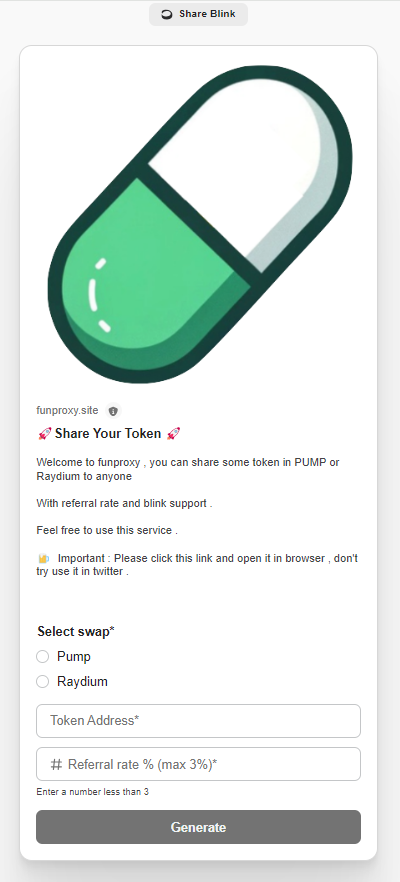

# How to use funproxy?

### Step 1 : Go to website/link generator

* You can visit [Dial.to generator](https://dial.to/?action=solana-action:https://funproxy.site/api/register)

<figure><figcaption>
Blinks 
</figcaption></figure>

* Or you can also visit our [website link generator](https://funproxy.site/)

<figure><figcaption></figcaption></figure>

### Step 2 : Input your token address and set the referral rate

* Find a token you like or launch a token in [pump ](http://pump.fun/)or raydium
* Set up your referral rate (Max 3%)

### Step 3 : Connect your wallet or input your solana wallet address manully

* You can try connect wallet in our link generator site .&#x20;
* Or simply input your solana address manully

### Click generate link . Done !

Generate the link , and share it into your twitter !&#x20;
